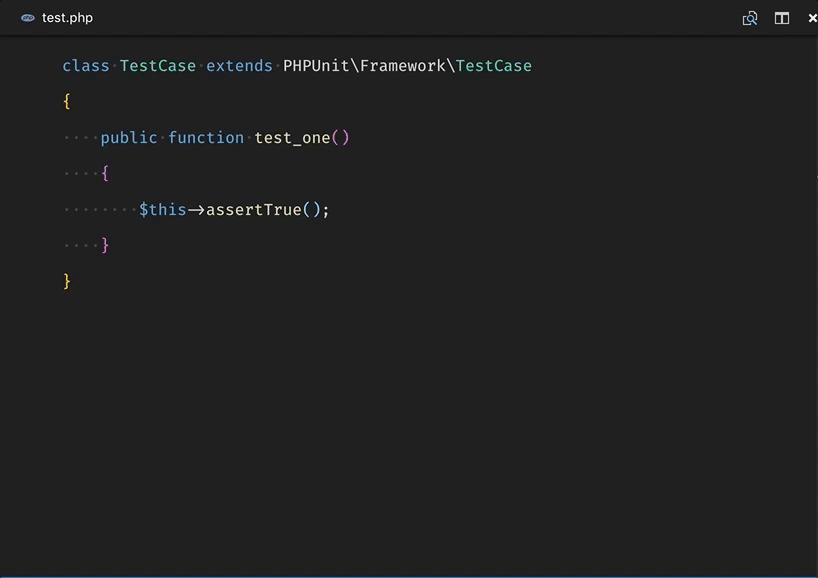

# Better PHPUnit



## Running a specific test method:
- Place your cursor in/on the method you want to run
- Open the command menu: `cmd+shift+p`
- Select: `Tasks: Run Task`
- Select: `phpunit: run` to run a phpunit method

## Running an entire test file:
- Place your cursor on/above the class declaration line
- Open the command menu: `cmd+shift+p`
- Select: `Tasks: Run Task`
- Select: `phpunit: run` to run a phpunit method

## Run the previous test:
- Open the command menu: `cmd+shift+p`
- Select: `Tasks: Run Task`
- Select: `phpunit: run previous` to run the last executed test

## Features:
- Color output!
- Run individual methods by placing your cursor anywhere in/on the method
- Test failures are displayed in the "Problems" panel for quick access

> Note: this plugin registers "tasks" to run phpunit, not a command like other extensions. This makes it possible to leverage the problem output and color terminal.

Keybindings:
> Note: you will have to add these bindings to your own `keybindings.json` file, otherwise, the bindings will not work right.
```
{
    "key": "cmd+k cmd+r",
    "command": "workbench.action.tasks.runTask",
    "args": "phpunit: run"
},
{
    "key": "cmd+k cmd+p",
    "command": "workbench.action.tasks.runTask",
    "args": "phpunit: run previous"
}
```

## Roadmap:
- Not using tasks, but using plain commands?
- Handling PHP fatal and parser errors
- A sidebar panel for managing errors
- Re-run failures